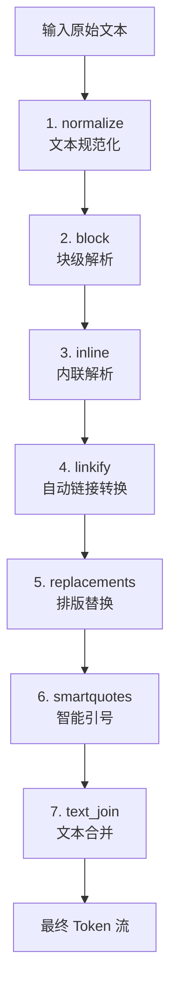
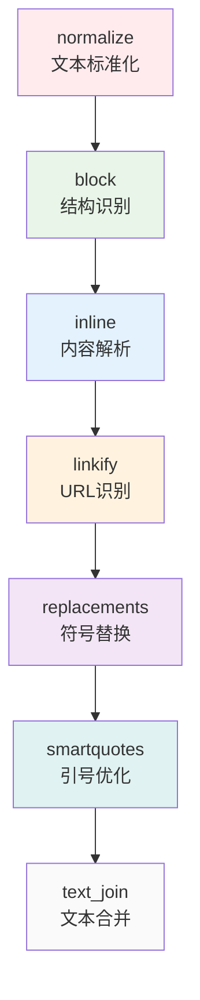

# Markdown-it 核心处理七步骤详解

## 概述

Markdown-it 的核心解析流程包含七个严格按顺序执行的步骤，每个步骤都有特定的职责和处理目标。这种分层处理方式确保了解析结果的准确性和一致性。



---

## 第一步：normalize - 文本规范化

### 🎯 作用和目标
对输入的原始 Markdown 文本进行标准化处理，确保后续处理步骤能够在统一的文本格式基础上工作。

### 🔧 具体处理内容

#### 1. 换行符标准化
```javascript
const NEWLINES_RE = /\r\n?|\n/g
str = state.src.replace(NEWLINES_RE, '\n')
```

**处理细节:**
- **Windows 换行符** (`\r\n`) → Unix 换行符 (`\n`)
- **Mac 经典换行符** (`\r`) → Unix 换行符 (`\n`)
- **Unix 换行符** (`\n`) → 保持不变

**意义:** 统一换行符格式，避免跨平台兼容性问题

#### 2. NULL 字符处理
```javascript
const NULL_RE = /\0/g
str = str.replace(NULL_RE, '\uFFFD')
```

**处理细节:**
- 将所有 NULL 字符 (`\0`) 替换为 Unicode 替换字符 (`\uFFFD`)
- 防止 NULL 字符干扰后续解析过程
- 符合 CommonMark 规范要求

### 📋 规范依据
- 遵循 [CommonMark 规范 0.29 行结束部分](https://spec.commonmark.org/0.29/#line-ending)
- 确保文本在不同操作系统间的一致性

### 🏷️ 输出结果
- 规范化的文本字符串，存储在 `state.src` 中
- 为后续所有解析步骤提供统一的输入基础

---

## 第二步：block - 块级元素解析

### 🎯 作用和目标
将规范化后的文本解析为块级元素的 Token 序列，识别段落、标题、列表、引用等文档结构。

### 🔧 具体处理流程

#### 1. 模式判断
```javascript
if (state.inlineMode) {
    // 内联模式：创建单个 inline token
    token = new state.Token('inline', '', 0)
    token.content = state.src
    token.map = [0, 1]
    token.children = []
    state.tokens.push(token)
} else {
    // 完整模式：进行块级解析
    state.md.block.parse(state.src, state.md, state.env, state.tokens)
}
```

#### 2. 块级规则链处理
当处于完整模式时，会调用 `ParserBlock.parse()` 方法，按优先级执行以下规则：

| 规则名称 | 处理元素 | 优先级 | 说明 |
|---------|---------|--------|------|
| `table` | 表格 | 最高 | GFM 表格语法 |
| `code` | 缩进代码块 | 高 | 4空格或1制表符缩进 |
| `fence` | 围栏代码块 | 高 | ``` 或 ~~~ 包围 |
| `blockquote` | 引用块 | 高 | > 开头的引用 |
| `hr` | 水平分割线 | 高 | --- 或 *** |
| `list` | 列表 | 中 | 有序/无序列表 |
| `reference` | 引用定义 | 中 | [label]: url "title" |
| `html_block` | HTML块 | 中 | 块级HTML标签 |
| `heading` | ATX标题 | 中 | # 开头的标题 |
| `lheading` | Setext标题 | 低 | 下划线标题 |
| `paragraph` | 段落 | 最低 | 默认处理 |

#### 3. 解析机制
- **贪婪匹配**: 每个规则尝试匹配尽可能多的内容
- **优先级控制**: 高优先级规则先执行，避免冲突
- **嵌套支持**: 支持块级元素的嵌套结构

### 📋 输出结果
生成块级 Token 序列，每个 Token 包含：
- `type`: Token 类型（如 `paragraph_open`, `heading_open`）
- `tag`: 对应的 HTML 标签
- `content`: 块级内容（用于后续内联解析）
- `map`: 源码位置映射

---

## 第三步：inline - 内联元素解析

### 🎯 作用和目标
解析块级 Token 中的内联内容，识别强调、链接、图片、代码等内联元素，生成详细的内联 Token 树。

### 🔧 具体处理流程

#### 1. Token 遍历
```javascript
const tokens = state.tokens
for (let i = 0, l = tokens.length; i < l; i++) {
    const tok = tokens[i]
    if (tok.type === 'inline') {
        state.md.inline.parse(tok.content, state.md, state.env, tok.children)
    }
}
```

#### 2. 内联规则链执行
对每个 `inline` 类型的 Token，执行以下规则：

**主解析规则链:**
| 规则名称 | 处理元素 | 说明 |
|---------|---------|------|
| `text` | 普通文本 | 基础文本处理 |
| `linkify` | 自动链接 | URL 自动识别 |
| `newline` | 换行处理 | 软/硬换行 |
| `escape` | 转义字符 | \ 转义序列 |
| `backticks` | 行内代码 | ` 包围的代码 |
| `strikethrough` | 删除线 | ~~ 包围的文本 |
| `emphasis` | 强调 | * 或 _ 的强调/加粗 |
| `link` | 链接 | [text](url) 格式 |
| `image` | 图片 |  格式 |
| `autolink` | 自动链接 | <url> 格式 |
| `html_inline` | 内联HTML | HTML标签 |
| `entity` | HTML实体 | &amp; 等 |

**后处理规则链:**
| 规则名称 | 作用 | 说明 |
|---------|------|------|
| `balance_pairs` | 平衡成对标记 | 处理嵌套的强调等 |
| `strikethrough` | 删除线后处理 | 优化删除线标记 |
| `emphasis` | 强调后处理 | 优化强调标记 |
| `fragments_join` | 片段合并 | 合并相邻文本片段 |

#### 3. 处理机制
- **双阶段处理**: 先解析后优化，确保复杂嵌套的正确性
- **缓存优化**: 避免重复解析相同位置
- **嵌套限制**: 防止过深嵌套导致栈溢出

### 📋 输出结果
将原来的 `inline` Token 的 `children` 属性填充为详细的内联 Token 数组。

---

## 第四步：linkify - 自动链接转换

### 🎯 作用和目标
自动识别文本中类似 URL 的内容，将其转换为可点击的链接，提供更好的用户体验。

### 🔧 具体处理流程

#### 1. 启用条件检查
```javascript
if (!state.md.options.linkify) { return }
```
只有当 `linkify` 选项启用时才执行。

#### 2. 预检测和精确匹配
```javascript
if (!state.md.linkify.pretest(blockTokens[j].content)) {
    continue  // 快速跳过不包含链接的内容
}

let links = state.md.linkify.match(text)  // 精确匹配URL
```

#### 3. 上下文感知处理

**避免双重链接化:**
- 跳过已存在的 Markdown 链接内容
- 跳过 HTML 链接标签内的内容
- 跳过转义序列（如 `http\://example.com`）

**HTML 链接检测:**
```javascript
if (isLinkOpen(currentToken.content) && htmlLinkLevel > 0) {
    htmlLinkLevel--  // 进入HTML链接
}
if (isLinkClose(currentToken.content)) {
    htmlLinkLevel++  // 退出HTML链接
}
```

#### 4. URL 处理和验证

**安全验证:**
```javascript
const fullUrl = state.md.normalizeLink(url)
if (!state.md.validateLink(fullUrl)) { continue }
```

**协议处理:**
- 无协议域名: `example.com` → `http://example.com`
- 邮箱地址: `user@domain.com` → `mailto:user@domain.com`
- Punycode 编码处理国际化域名

#### 5. Token 生成

为每个识别的链接生成三个 Token:
```javascript
// 开始标签
const token_o = new state.Token('link_open', 'a', 1)
token_o.attrs = [['href', fullUrl]]
token_o.markup = 'linkify'
token_o.info = 'auto'

// 链接文本
const token_t = new state.Token('text', '', 0)
token_t.content = urlText

// 结束标签
const token_c = new state.Token('link_close', 'a', -1)
token_c.markup = 'linkify'
token_c.info = 'auto'
```

### 📋 支持的 URL 类型
- HTTP/HTTPS URLs
- FTP URLs  
- 邮箱地址
- 国际化域名 (Punycode)

### 🔒 安全特性
- URL 验证防止恶意链接
- 自动转义特殊字符
- 避免链接嵌套导致的问题

---

## 第五步：replacements - 排版替换

### 🎯 作用和目标
执行高级排版替换，将常见的文本序列转换为更美观的排版符号，提升文档的视觉质量。

### 🔧 具体处理流程

#### 1. 启用条件检查
```javascript
if (!state.md.options.typographer) { return }
```
只有当 `typographer` 选项启用时才执行。

#### 2. 有范围的缩写替换
处理括号内的版权标记：

```javascript
const SCOPED_ABBR = {
  c: '©',    // (c) → ©
  r: '®',    // (r) → ®  
  tm: '™'    // (tm) → ™
}
```

**匹配模式**: `/\((c|tm|r)\)/ig`
- 大小写不敏感
- 必须在括号内
- 避免在自动链接中替换

#### 3. 稀有符号替换
处理各种排版符号：

| 原始文本 | 替换结果 | 说明 |
|---------|---------|------|
| `+-` | `±` | 正负号 |
| `...` | `…` | 省略号 |
| `????` | `???` | 限制问号数量 |
| `!!!!` | `!!!` | 限制感叹号数量 |
| `,,` | `,` | 限制逗号数量 |
| `---` | `—` | em 破折号 |
| `--` | `–` | en 破折号 |

**破折号处理规则:**
```javascript
// em-dash: 三个连字符
.replace(/(^|[^-])---(?=[^-]|$)/mg, '$1\u2014')

// en-dash: 两个连字符
.replace(/(^|\s)--(?=\s|$)/mg, '$1\u2013')          // 空格包围
.replace(/(^|[^-\s])--(?=[^-\s]|$)/mg, '$1\u2013')  // 非空格非连字符包围
```

**省略号处理:**
```javascript
// 2个或更多点 → 省略号
.replace(/\.{2,}/g, '…')
// 但是保留问号和感叹号后的两个点
.replace(/([?!])…/g, '$1..')
```

#### 4. 上下文保护
- 跳过自动链接内部的文本
- 保持链接 URL 的完整性
- 维护代码块内容不变

### 📋 排版增强效果
- **视觉质量提升**: 专业的排版符号
- **阅读体验优化**: 符合排版规范
- **国际化支持**: 通用的排版符号

---

## 第六步：smartquotes - 智能引号

### 🎯 作用和目标
将直引号转换为排版引号（弯引号），根据上下文智能判断开合引号，显著提升文本的排版质量。

### 🔧 具体处理流程

#### 1. 启用条件和预检测
```javascript
if (!state.md.options.typographer) { return }
if (!QUOTE_TEST_RE.test(state.tokens[blkIdx].content)) {
    continue  // 跳过不包含引号的内容
}
```

#### 2. 引号类型识别
- **单引号** (`'`): 用于次级引用和撇号
- **双引号** (`"`): 用于主要引用

#### 3. 上下文分析算法

**字符环境检测:**
```javascript
// 分析前一个字符
let lastChar = 0x20  // 默认为空格
if (t.index - 1 >= 0) {
    lastChar = text.charCodeAt(t.index - 1)
} else {
    // 跨Token查找前一个字符
    for (j = i - 1; j >= 0; j--) {
        if (tokens[j].type === 'softbreak' || tokens[j].type === 'hardbreak') break
        if (!tokens[j].content) continue
        lastChar = tokens[j].content.charCodeAt(tokens[j].content.length - 1)
        break
    }
}

// 分析后一个字符 (类似逻辑)
let nextChar = 0x20
```

**开合判断规则:**

```javascript
// 开引号条件
if (isNextWhiteSpace) {
    canOpen = false  // 后面是空格，不能开启
} else if (isNextPunctChar) {
    if (!(isLastWhiteSpace || isLastPunctChar)) {
        canOpen = false  // 后面是标点，前面不是空格或标点，不能开启
    }
}

// 合引号条件  
if (isLastWhiteSpace) {
    canClose = false  // 前面是空格，不能关闭
} else if (isLastPunctChar) {
    if (!(isNextWhiteSpace || isNextPunctChar)) {
        canClose = false  // 前面是标点，后面不是空格或标点，不能关闭
    }
}
```

#### 4. 特殊情况处理

**数字+双引号 (英寸符号):**
```javascript
if (nextChar === 0x22 && t[0] === '"') {
    if (lastChar >= 0x30 && lastChar <= 0x39) {
        // 1"" - 第一个引号当作英寸符号
        canClose = canOpen = false
    }
}
```

**标点序列中的引号:**
```javascript
if (canOpen && canClose) {
    // 在标点序列中优先处理
    // foo-"-bar-"-baz → 替换
    // foo " bar " baz → 不替换
    canOpen = isLastPunctChar
    canClose = isNextPunctChar
}
```

**撇号处理:**
```javascript
if (!canOpen && !canClose) {
    if (isSingle) {
        // 单引号在词中间，当作撇号处理
        token.content = replaceAt(token.content, t.index, APOSTROPHE)
    }
}
```

#### 5. 配对匹配系统

**栈管理:**
```javascript
const stack = []  // 维护未匹配的开引号

// 遇到可能的开引号
if (canOpen) {
    stack.push({
        token: i,        // Token 索引
        pos: t.index,    // 字符位置
        single: isSingle, // 是否单引号
        level: thisLevel  // 嵌套层级
    })
}

// 遇到可能的合引号，在栈中寻找匹配
if (canClose) {
    for (j = stack.length - 1; j >= 0; j--) {
        if (item.single === isSingle && stack[j].level === thisLevel) {
            // 找到匹配，执行替换
            break
        }
    }
}
```

#### 6. 引号配置

根据 `options.quotes` 配置使用不同的引号样式:
```javascript
// 默认英文引号
quotes: '\u201c\u201d\u2018\u2019'  // ""''

// 德文引号示例
quotes: '„"‚''

// 法文引号示例  
quotes: ['«\xA0', '\xA0»', '‹\xA0', '\xA0›']
```

### 📋 智能特性
- **上下文感知**: 基于周围字符判断开合
- **嵌套支持**: 正确处理引号嵌套
- **多语言支持**: 可配置不同语言的引号样式
- **撇号识别**: 智能区分撇号和引号

---

## 第七步：text_join - 文本合并优化

### 🎯 作用和目标
作为最后的优化步骤，合并相邻的文本 Token，减少 Token 数量，提高渲染性能，并为插件提供最后的文本处理机会。

### 🔧 具体处理流程

#### 1. 特殊 Token 类型转换
```javascript
for (curr = 0; curr < max; curr++) {
    if (tokens[curr].type === 'text_special') {
        tokens[curr].type = 'text'  // 转换为普通文本
    }
}
```

**`text_special` 的作用:**
- 在解析过程中标记需要特殊处理的文本
- 防止在中间步骤被意外修改
- 最终阶段转换为普通文本参与合并

#### 2. 相邻文本合并算法
```javascript
for (curr = last = 0; curr < max; curr++) {
    if (tokens[curr].type === 'text' &&
        curr + 1 < max &&
        tokens[curr + 1].type === 'text') {
        
        // 合并当前和下一个文本Token
        tokens[curr + 1].content = tokens[curr].content + tokens[curr + 1].content
        
        // 当前Token将被跳过（不复制到新位置）
    } else {
        // 非文本Token或无法合并的Token，复制到新位置
        if (curr !== last) { 
            tokens[last] = tokens[curr] 
        }
        last++
    }
}
```

#### 3. 数组压缩
```javascript
if (curr !== last) {
    tokens.length = last  // 截断数组，移除空位
}
```

### 📋 处理示例

**合并前:**
```javascript
[
  { type: 'text', content: 'Hello ' },
  { type: 'text', content: 'world' },
  { type: 'emphasis_open', tag: 'em' },
  { type: 'text', content: 'beautiful' },
  { type: 'emphasis_close', tag: 'em' },
  { type: 'text', content: ' day' },
  { type: 'text', content: '!' }
]
```

**合并后:**
```javascript
[
  { type: 'text', content: 'Hello world' },
  { type: 'emphasis_open', tag: 'em' },
  { type: 'text', content: 'beautiful' },
  { type: 'emphasis_close', tag: 'em' },
  { type: 'text', content: ' day!' }
]
```

### 🎯 优化效果
- **减少 Token 数量**: 合并相邻文本，简化 Token 树
- **提升渲染性能**: 更少的 Token 意味着更快的遍历和渲染
- **内存优化**: 减少对象数量，降低内存占用
- **插件友好**: 为插件提供最终的文本处理时机

### 🔧 插件集成点
text_join 步骤专门为插件提供了文本后处理的机会：

```javascript
// 插件示例：emoji 替换
function emojiPlugin(md) {
    // 在 text_join 之前插入自定义规则
    md.core.ruler.before('text_join', 'emoji', function(state) {
        // 处理 emoji 替换，如 :) → 😊
        // 这里的处理不会被 text_join 影响
    })
}
```

---

## 总结：七步骤的协同设计

### 🔗 步骤间的依赖关系



### 🎯 设计原则

1. **单一职责**: 每个步骤只负责特定的处理任务
2. **严格顺序**: 后续步骤依赖前续步骤的输出
3. **可选执行**: 大部分步骤都有开关控制
4. **安全处理**: 每个步骤都考虑上下文保护
5. **性能优化**: 预检测和缓存机制避免无用功

### 🚀 性能特性

- **增量处理**: 每步只处理必要的内容
- **早期退出**: 预检测机制快速跳过不相关内容  
- **缓存机制**: 避免重复计算
- **内存优化**: 及时合并和清理临时对象

### 🔒 安全考虑

- **输入验证**: normalize 阶段处理恶意字符
- **上下文保护**: 各步骤都避免破坏已处理内容
- **嵌套限制**: 防止过深嵌套导致性能问题
- **XSS 防护**: linkify 阶段验证 URL 安全性

这七个步骤的精心设计确保了 markdown-it 能够可靠、高效地将 Markdown 文本转换为结构化的 Token 流，为最终的 HTML 渲染奠定了坚实的基础。
