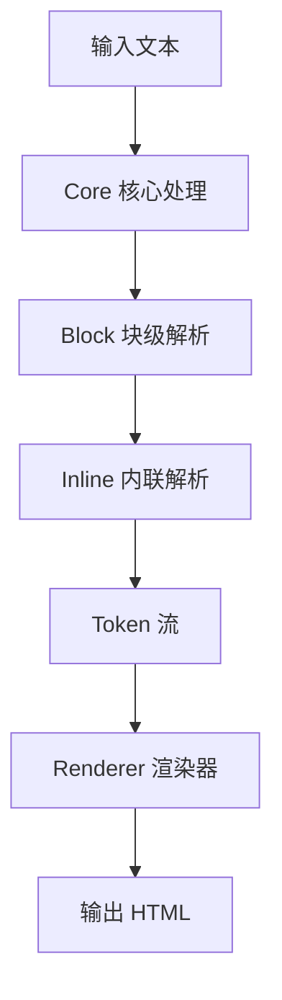

# Markdown-it 设计与实现深度分析

## 概述

Markdown-it 是一个功能强大、可扩展的 Markdown 解析器，采用了清晰的三层架构设计。它以性能、安全性和可扩展性为核心目标，提供了灵活的插件机制和规则系统。

## 核心架构设计

### 1. 整体架构

Markdown-it 采用了**三层处理流水线**的设计模式：



**处理流程:**
1. **规范化阶段** (Core): 预处理输入文本，标准化格式
2. **块级解析** (Block): 识别段落、标题、列表等块级元素
3. **内联解析** (Inline): 解析强调、链接等内联元素
4. **后处理** (Core): 链接化、排版增强等
5. **渲染输出** (Renderer): 将 Token 转换为 HTML

### 2. 核心组件分析

#### 2.1 MarkdownIt 主类 (`index.mjs`)

**职责:**
- 作为整个解析器的门面(Facade)模式实现
- 协调各个组件的工作
- 提供配置管理和插件加载机制

**关键方法:**
```javascript
// 主要解析流程
parse(src, env) → tokens     // 文本 → Token 流
render(src, env) → html      // 文本 → HTML
renderInline(src, env) → html // 内联文本 → HTML

// 配置管理
configure(preset)            // 应用预设配置
set(options)                // 设置选项
enable/disable(rules)       // 启用/禁用规则

// 插件机制
use(plugin, ...params)      // 加载插件
```

**安全机制:**
- `validateLink()`: 防止 XSS 攻击，过滤危险协议
- `normalizeLink()`: URL 规范化和 Punycode 编码
- 内建转义机制防止代码注入

#### 2.2 Token 系统 (`token.mjs`)

**设计思想:**
Token 是 markdown-it 的核心数据结构，表示文档的抽象语法树(AST)节点。

**Token 类型:**
- **开始标记** (`nesting = 1`): 如 `paragraph_open`
- **结束标记** (`nesting = -1`): 如 `paragraph_close`  
- **自闭合标记** (`nesting = 0`): 如 `image`, `code_inline`

**关键属性:**
```javascript
{
  type: 'paragraph_open',     // Token 类型
  tag: 'p',                   // HTML 标签
  attrs: [['class', 'text']], // 属性数组
  map: [1, 2],               // 源码位置映射
  level: 0,                  // 嵌套层级
  children: [],              // 子 Token
  content: '',               // 内容
  info: '',                  // 附加信息
  markup: '',                // 原始标记
  block: true,               // 是否块级
  hidden: false              // 是否隐藏
}
```

**优势:**
- 统一的数据结构便于处理和扩展
- 详细的源码映射支持错误定位和编辑器集成
- 灵活的属性系统支持自定义渲染

#### 2.3 Ruler 规则管理器 (`ruler.mjs`)

**设计模式:** 责任链模式 + 策略模式

**核心功能:**
- 管理解析规则的执行顺序
- 支持规则的动态启用/禁用
- 提供规则链的缓存机制

**规则链结构:**
```javascript
// 规则定义
{
  name: 'emphasis',        // 规则名称
  enabled: true,           // 启用状态
  fn: emphasisRule,        // 处理函数
  alt: ['paragraph']       // 备选链
}
```

**性能优化:**
- 懒加载编译: 只有在需要时才编译规则链
- 缓存机制: 避免重复计算活跃规则
- 快速查找: 使用索引加速规则查找

### 3. 解析器架构

#### 3.1 Core 核心解析器 (`parser_core.mjs`)

**角色:** 总指挥，控制整个解析流程

**处理流程:**
```javascript
const coreRules = [
  'normalize',      // 1. 文本规范化
  'block',          // 2. 块级解析
  'inline',         // 3. 内联解析  
  'linkify',        // 4. 自动链接
  'replacements',   // 5. 排版替换
  'smartquotes',    // 6. 智能引号
  'text_join'       // 7. 文本合并
]
```

**状态管理:**
- `StateCore`: 维护全局解析状态
- 在规则间传递 tokens 和环境信息
- 支持内联模式和完整模式

#### 3.2 Block 块级解析器 (`parser_block.mjs`)

**处理策略:** 贪婪匹配 + 优先级排序

**规则优先级:**
```javascript
const blockRules = [
  'table',          // 表格 (最高优先级)
  'code',           // 代码块
  'fence',          // 围栏代码
  'blockquote',     // 引用
  'hr',             // 分割线
  'list',           // 列表
  'reference',      // 引用定义
  'html_block',     // HTML 块
  'heading',        // 标题
  'lheading',       // 下划线标题
  'paragraph'       // 段落 (默认/最低优先级)
]
```

**处理机制:**
- 逐行扫描，匹配合适的块级规则
- 支持嵌套结构(如列表中的段落)
- 终止条件控制，防止规则冲突

#### 3.3 Inline 内联解析器 (`parser_inline.mjs`)

**双规则链设计:**

**主规则链** (解析阶段):
```javascript
const inlineRules = [
  'text',           // 普通文本
  'linkify',        // 自动链接
  'newline',        // 换行处理
  'escape',         // 转义字符
  'backticks',      // 行内代码
  'strikethrough',  // 删除线
  'emphasis',       // 强调
  'link',           // 链接
  'image',          // 图片
  'autolink',       // 自动链接
  'html_inline',    // 内联 HTML
  'entity'          // HTML 实体
]
```

**后处理规则链** (优化阶段):
```javascript
const postProcessRules = [
  'balance_pairs',    // 平衡成对标记
  'strikethrough',    // 删除线后处理
  'emphasis',         // 强调后处理  
  'fragments_join'    // 片段合并
]
```

**优化机制:**
- 缓存系统: 避免重复解析相同位置
- 嵌套限制: 防止栈溢出
- 分阶段处理: 先解析再优化

### 4. 渲染系统 (`renderer.mjs`)

#### 4.1 渲染器设计

**设计模式:** 访问者模式

**核心机制:**
```javascript
// 渲染规则映射
rules = {
  'paragraph_open': (tokens, idx) => '<p>',
  'paragraph_close': () => '</p>',
  'text': (tokens, idx) => escapeHtml(tokens[idx].content)
}
```

**渲染流程:**
1. 遍历 Token 流
2. 根据 Token 类型查找对应渲染规则
3. 执行渲染规则生成 HTML 片段
4. 处理嵌套和格式化

#### 4.2 默认渲染规则

**代码处理:**
- `code_inline`: 行内代码 `<code>`
- `code_block`: 缩进代码块 `<pre><code>`  
- `fence`: 围栏代码块，支持语法高亮

**文本处理:**
- `text`: HTML 转义
- `hardbreak`: 硬换行 `<br>`
- `softbreak`: 软换行处理

**安全特性:**
- 自动 HTML 转义
- 属性值过滤
- XSS 防护

### 5. 配置系统

#### 5.1 预设配置

**三种预设:**

**default** - 默认配置:
```javascript
{
  html: false,          // 禁用 HTML
  xhtmlOut: false,      // HTML 风格标签
  breaks: false,        // 不转换单换行
  linkify: false,       // 禁用自动链接
  typographer: false    // 禁用排版增强
}
```

**commonmark** - CommonMark 严格模式:
```javascript
{
  html: true,           // 允许 HTML
  xhtmlOut: true,       // XHTML 风格
  maxNesting: 20,       // 较低嵌套限制
  // 只启用核心规则，严格符合规范
}
```

**zero** - 零配置模式:
```javascript
{
  // 禁用所有规则，用于自定义构建
}
```

#### 5.2 插件机制

**插件架构:**
```javascript
// 插件就是函数
function myPlugin(md, options) {
  // 添加新规则
  md.block.ruler.before('paragraph', 'my_rule', myRule)
  
  // 修改渲染器
  md.renderer.rules.my_token = myRenderer
  
  // 修改选项
  md.set({ myOption: true })
}

// 使用插件
md.use(myPlugin, { option: 'value' })
```

**扩展点:**
- 添加新的解析规则
- 修改现有规则行为
- 自定义渲染输出
- 注入预处理/后处理逻辑

## 核心设计模式分析

### 1. 责任链模式 (Chain of Responsibility)

**应用场景:** 规则链执行
- 每个规则都有机会处理输入
- 按优先级顺序尝试匹配
- 找到匹配规则后停止传递

**优势:**
- 解耦规则之间的依赖
- 动态调整处理顺序
- 易于添加新规则

### 2. 策略模式 (Strategy)

**应用场景:** 渲染规则
- 每种 Token 类型对应一个渲染策略
- 运行时动态选择合适的策略
- 支持自定义策略替换

**优势:**
- 渲染逻辑高度可配置
- 便于扩展新的输出格式
- 算法与上下文分离

### 3. 访问者模式 (Visitor)

**应用场景:** Token 树遍历
- 渲染器作为访问者遍历 Token 树
- 根据节点类型调用相应方法
- 分离数据结构与操作算法

### 4. 外观模式 (Facade)

**应用场景:** MarkdownIt 主类
- 隐藏复杂的内部子系统
- 提供简化的统一接口
- 降低客户端使用复杂度

## 性能优化策略

### 1. 缓存机制

**规则链缓存:**
- 编译后的规则链缓存避免重复计算
- 按需编译，延迟初始化

**内联解析缓存:**
- 缓存已解析位置，避免重复工作
- 基于位置的快速查找

### 2. 算法优化

**贪婪匹配:**
- 块级解析使用贪婪策略，减少回溯
- 优先级排序避免不必要的尝试

**增量处理:**
- 逐字符/逐行处理，减少内存占用
- 流式处理支持大文档

### 3. 内存管理

**对象重用:**
- Token 对象池复用
- 状态对象生命周期管理

**垃圾回收友好:**
- 避免循环引用
- 及时清理临时对象

## 安全机制

### 1. XSS 防护

**URL 验证:**
```javascript
// 危险协议过滤
const BAD_PROTO_RE = /^(vbscript|javascript|file|data):/
const GOOD_DATA_RE = /^data:image\/(gif|png|jpeg|webp);/

function validateLink(url) {
  const str = url.trim().toLowerCase()
  return BAD_PROTO_RE.test(str) ? GOOD_DATA_RE.test(str) : true
}
```

**HTML 转义:**
- 自动转义用户输入
- 属性值严格过滤
- 内容安全策略友好

### 2. 资源限制

**嵌套深度限制:**
```javascript
maxNesting: 100  // 防止栈溢出
```

**内容长度控制:**
- 防止过长输入导致性能问题
- 合理的资源使用限制

## 扩展性设计

### 1. 插件系统

**热插拔能力:**
- 运行时动态加载插件
- 插件间隔离，避免冲突
- 丰富的扩展点

### 2. 规则系统

**规则链可配置:**
- 启用/禁用任意规则
- 调整规则优先级
- 插入自定义规则

### 3. 渲染可定制

**输出格式灵活:**
- 支持多种输出格式 (HTML, React 等)
- 自定义渲染规则
- 渲染钩子机制

## 最佳实践总结

### 1. 架构设计

✅ **清晰的分层架构** - 职责分离，易于理解和维护
✅ **统一的数据结构** - Token 系统提供一致的处理方式  
✅ **可插拔的组件设计** - 高度模块化，便于扩展
✅ **完善的配置系统** - 满足不同使用场景需求

### 2. 性能优化

✅ **多级缓存策略** - 减少重复计算
✅ **算法复杂度控制** - 避免性能陷阱
✅ **内存使用优化** - 适合处理大文档
✅ **渐进式解析** - 支持流式处理

### 3. 安全考虑

✅ **输入验证和过滤** - 防止恶意输入
✅ **输出转义机制** - 防止 XSS 攻击
✅ **资源使用限制** - 防止 DoS 攻击
✅ **安全的默认配置** - 开箱即用的安全性

### 4. 开发体验

✅ **丰富的扩展机制** - 满足自定义需求
✅ **清晰的 API 设计** - 易于学习使用
✅ **完善的错误处理** - 友好的调试体验  
✅ **详细的源码映射** - 支持编辑器集成

## 结论

Markdown-it 是一个设计优秀的 Markdown 解析器，它成功地平衡了性能、安全性、可扩展性和易用性。其核心设计思想包括：

1. **分而治之** - 将复杂问题分解为多个简单子问题
2. **高内聚低耦合** - 各组件职责单一，接口清晰
3. **开放封闭原则** - 对扩展开放，对修改封闭
4. **防御性编程** - 充分考虑安全性和健壮性

这些设计思想使得 markdown-it 成为了一个可靠、高效且易于扩展的 Markdown 处理工具，为开发者提供了优秀的使用体验和扩展能力。


